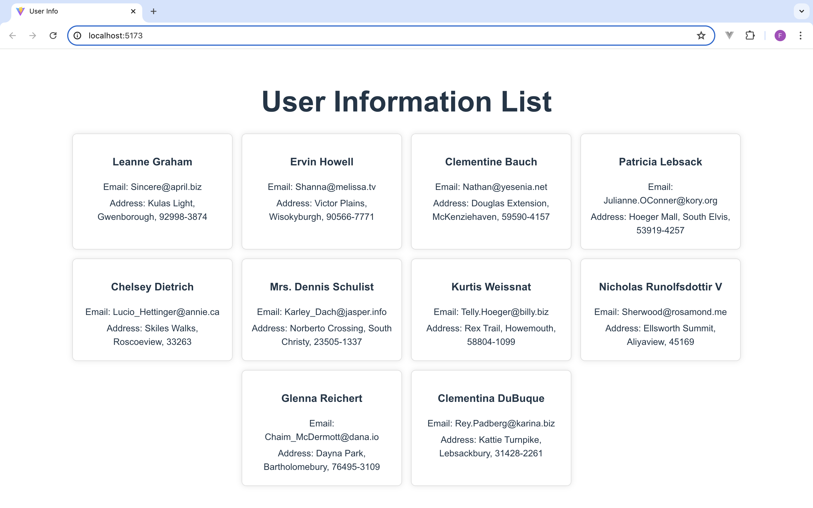

题目二：获取并展示用户数据

要求：
1. 使用 React 和 TypeScript 开发。
2. 通过 HTTP 请求从以下 API 获取用户数据：
   https://jsonplaceholder.typicode.com/users
3. 处理 HTTP 请求的各种状态，包括加载中、成功和错误。
4. 将返回的 JSON 数据结构化渲染成前端组件。
5. 每个用户的信息应显示在一个卡片中，卡片应包含以下信息：
    - 用户名
    - 邮箱
    - 地址（街道，城市，邮编）
6. 使用 CSS 美化界面，使其简洁、美观。

附加要求：
1. 组件化设计：将用户卡片、加载状态、错误状态等拆分成独立的组件。
2. 异常处理：当请求失败时，显示错误信息。
3. 使用 TypeScript 类型定义所有相关的 props 和 state。

提示：
- 你可以使用任何你熟悉的 HTTP 库，如 Axios 或 Fetch API。
- 尽量使用函数组件和 React Hooks。

示例界面：

------------------------------------
|         用户信息列表              |
------------------------------------
|  用户名: Leanne Graham            |
|  邮箱: Sincere@april.biz          |
|  地址: Kulas Light, Gwenborough,  |
|        92998-3874                 |
------------------------------------
|  用户名: Ervin Howell             |
|  邮箱: Shanna@melissa.tv          |
|  地址: Victor Plains, Wisokyburgh,|
|        90566-7771                 |
------------------------------------

提交内容：
1. 项目完整的源代码。
2. 详细的代码注释，解释你的思路和设计。
3. 截图或 GIF，展示应用的实际运行效果。